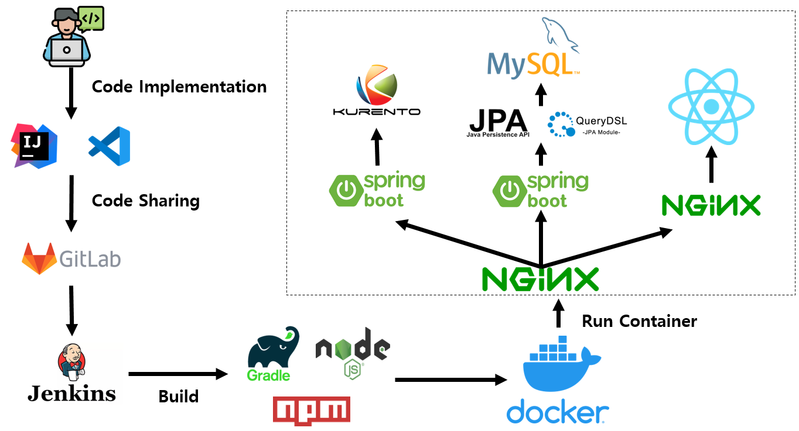

<div align="center">
  <br />
  
  <br />
</div>

<br/>

# Do Learn Do Learn Project

<br>

## 💡 서비스 소개

### 두런두런(Do Learn Do Learn)

> 넘쳐나는 강의😥 그러나 내게 꼭 맞는 강의 찾기가 힘들지 않으신가요?<br />
원하는 강의가 없다면 이젠 찾지말고 직접 만들어보세요!!<br />
즉각적인 소통을 통해 주도적인 학습을 진행할 수 있습니다. 
>
### 더 나은 학습경험을 위한 공간, Do Learn에서 함께 공부하세요! 

<br/>


## 🛠️ 기술 스택

    <br>
    <br>
 
  <br/>

<details><summary> <b> 상세 기술스택 및 버전</b> </summary>

| 구분       | 기술스택                    | 상세내용                 | 버전          |
| -------- | ----------------------- | -------------------- | ----------- |
| 공통     | 형상관리                 | Gitlab               | \-          |
|          | 이슈관리                 | Jira                 | \-          |
|          | 커뮤니케이션             | Mattermost, Notion   | \-          |
| BackEnd  | DB                      | MySQL                | 8.0.21      |
|          |                         | JPA                  | \-          |
|          |                         | QueryDSL             | \-          |
|          | Java                    | OpenJDK              | 11.0.16.1   |
|          | Spring                  | Spring Boot          | 2.4.5       |                
|          | IDE                     | IntelliJ             | \-          |
|          | Build                   | Gradle               | 7.5.1       |
|          | WebRTC                  | Kurento Media Server | 6.18.0      |
|          | WebRTC                  | Kurento              | \-          |
| FrontEnd | HTML5                   |                      | \-          |
|          | CSS3                    |                      | \-          |
|          | JavaScript(ES6)         |                      |\-           |
|          | React                   | React                | 18.2.0      |
|          |                         | styled-components    | 5.3.6       |
|          |                         | axios                | 1.2.3       |
|          | WebSocket               | kurento-utils        | 6.18.0      |
|          | WebSocket               | stompjs              | 2.3.3       |
|          | WebSocket               | sockjs-client        | 1.6.1       |
|          | IDE                     | Visual Studio Code   | 1.75.1      |
| Server   | Server                   | AWS EC2              | \-          |
|          | Server                   | Nginx                 | 1.18.0      |
|          | 플랫폼                    | Ubuntu               | 20.04 LTS   |
|          | 배포                      | Docker               | 20.10.23    |
|          | 배포                      | Jenkins              | 2.375.3     |
|          | IDE                       | MobaXterm            | 23.0        |
| Test     | test                      | Postman              | 10.9.4      |
|          | test                      | JUnit5               | \-          |
|          | test                      | Mockito              | \-          |
|          | test                      | Jacoco               | toolVersion 0.8.7|
|          | test                      | Sonarqube            | \-          |

</details>

<br />


## 🗂️ 시스템 아키텍처

|                              시스템 아키텍처                           |
| :------------------------------------------------------------------------------: |
|  |


|                              CI/CD 배포 흐름도                           |
| :------------------------------------------------------------------------------: |
|  |

<br/>

## 디렉토리 구조 (Front-end)

``` java
C:.
+---assets
|   \---images
|       +---login
|       +---rank
|       +---sns
|       \---thumbnail
+---components
|   +---BoardList
|   +---Calendar
|   +---CardBox
|   +---LectProfile
|   +---LectureCameraContainer
|   +---LectureCancleModal
|   +---LectureChattingContainer
|   +---LectureFixedModal
|   +---LectureModal
|   +---LectureModalButton
|   +---LecturerList
|   +---LiveEvaluationModal
|   +---LiveOptionContainer
|   +---Message
|   +---MessageContainer
|   +---MessageDeleteModal
|   +---MessageDetailModal
|   +---MessageItem
|   +---Navbar
|   +---NewBoard
|   +---Pagination
|   +---Profile
|   +---ProfileCardBox
|   +---ProfileClock
|   +---ProfileEdit
|   +---ProfileSidebar
|   +---RankingItem
|   +---RankingList
|   +---SearchBar
|   +---SimpleSnackbar
|   +---SmallSchedule
|   +---SmallScheduleToggle
|   +---Timer
|   +---TodayScheduleItem
|   +---TotalScheduleItem
|   +---Typing
|   +---UniBoard
|   +---UnScheduleLecture
|   +---UnScheduleLectureItem
|   +---WarningModal
|   \---WriteButton
+---hooks
+---pages
|   +---Board
|   +---Home
|   +---Lecture
|   +---LecturerProfile
|   +---Loading
|   +---Login
|   +---NotFound
|   +---OauthRedirect
|   +---SignUp
|   +---User
|   \---WriteBoard
\---utils
    \---api
```

## 디렉토리 구조 (Back-end)

``` java
C:.
+---main
|   +---generated
|   +---java
|   |   \---com
|   |       \---example
|   |           \---dolearn
|   |               +---config
|   |               +---controller
|   |               +---domain
|   |               +---dto
|   |               +---exception
|   |               |   \---error
|   |               +---handler
|   |               +---jwt
|   |               +---repository
|   |               +---response
|   |               \---service
|   \---resources
\---test
    +---java
    |   \---com
    |       \---example
    |           \---dolearn
    |               +---config
    |               +---controller
    |               +---dto
    |               +---handler
    |               +---repository
    |               \---service
    \---resources
```


<br />


## 🖥️ 주요기능

### 강의 요청 게시물 등록
- 사용자가 원하는 주제를 정하여 강사와 수강생을 모집하는 게시글을 작성할 수 있습니다.
- 강의 제목, 모집 인원, 모집 기간 및 강의 일시 등을 작성합니다.
- 강의 일시를 오늘 날짜로 설정할 경우, 현재 시간 이후의 강의 시간만 선택 가능합니다.
- 하단의 <b>[ 등록 ]</b>을 통해 신규 게시글을 등록합니다.
    - 미기입된 항목을 검사하고, 기입해야할 내용이 있을 경우 경고 모달을 띄웁니다.
    - 사용자가 사전에 신청한 강의 목록을 검사하고 일정이 겹칠 경우 등록 불가합니다.

|              강의 요청 게시물 등록            |
| :---------------------------------------------------------------------------: |
|   |

### 기능3
- 학생, 선생님과 채팅이 가능하며, 지난 채팅 기록도 확인 가능합니다.
- 다른 유저가 채팅을 보내면 채팅 아이콘(말풍선)에 알림 표시가 나타납니다.

|                              기능3                       |
| :---------------------------------------------------------------------------: |
|    |

### 기능4
- 교사는 알림장(공지)을 작성할 수 있습니다.
- 카테고리 설정으로, 원하는 학생(학교 전체, 학년, 반)에게 보여지도록 설정합니다.
- toast-ui 에디터를 사용해서 글을 쉽게 편집할 수 있으며, Drag&Drop 으로 편리하게 첨부파일을 추가할 수 있습니다.  

|                              기능4                  |
| :---------------------------------------------------------------------------: |
|    |

|                              기능4                  |
| :---------------------------------------------------------------------------: |
|    |
    
### 기능5 
- 메인 페이지에서 [설정 > 홈 화면 설정] 을 클릭하면 홈 화면에 배치되는 위젯들을 관리할 수 있습니다.
- 배치를 원하는 위젯을 원하는 순서로 구성할 수 있습니다.

|                              기능5                      |
| :---------------------------------------------------------------------------: |
|    |

### 기능6
- 사용자의 눈 건강 및 취향을 고려하여 다크모드를 지원합니다.
- 메인 페이지에서 [설정 > 다크모드 on/off] 를 클릭하면 다크모드를 적용할 수 있습니다. 

|                              기능6                     |
| :---------------------------------------------------------------------------: |
|    |

<br/>


## 🎥 [UCC 보러가기](https://youtu.be/Rg4kOlrdI78) 

<br />

<div id="6"></div>

## 👥 협업 관리 

|    [Jira BurnDown Chart](https://ssafy.atlassian.net/jira/software/c/projects/S08P12A802/boards/1321)       |
| :---------------------------------------------------------------------------: |
| |

|     [Notion](https://www.notion.so/881849199de84e15bc1cd665e629d700)       |
| :---------------------------------------------------------------------------: |
|    |

<br />


## 👪 개발 멤버 소개 
<table>
    <tr>
        <td height="140px" align="center"> <a href="https://lab.ssafy.com/cksgnlcjswoo">
             <br><br> 👑 김찬휘 <br>(Back-End) </a> <br></td>
            <td height="140px" align="center"> <a href="https://lab.ssafy.com/ydg8732">
             <br><br> 😶 윤동균 <br>(Back-End) </a> <br></td>
        <td height="140px" align="center"> <a href="https://lab.ssafy.com/angly97">
             <br><br> 😆 민초현 <br>(Back-End) </a> <br></td>
        <td height="140px" align="center"> <a href="https://lab.ssafy.com/moxnox63">
             <br><br> 😁 정소영 <br>(Front-End) </a> <br></td>
        <td height="140px" align="center"> <a href="https://lab.ssafy.com/wjddnjs0528">
             <br><br> 🙄 김정원 <br>(Front-End) </a> <br></td>
        <td height="140px" align="center"> <a href="https://lab.ssafy.com/pjw2369">
             <br><br> 🙂 박중원 <br>(Front-End) </a> <br></td>
    </tr>
    <tr>
        <td align="center">REST API<br/>WebRTC<br/>WebSocket<br/>Infra<br/>Message<br/>Social Login</td>
        <td align="center">REST API<br/>DataBase<br/>Infra<br/>WebRTC<br/>Board<br/>Lecture<br/></td>
        <td align="center">REST API<br/>CI/CD<br/>Infra<br/>DataBase<br/>JWT Login<br/>User</td>
        <td align="center">UI/UX<br/>React<br/>UCC<br/>Board<br/>Test<br/>Lecture</td>
        <td align="center">UI/UX<br/>React<br/>Design<br/>Message<br/>Profile<br/>MyPage</td>
        <td align="center">UI/UX<br/>React<br/>WebRTC<br/>WebSocket<br/>User<br/>JWT Login</td>
    </tr>
</table>

<br />

## 📆 프로젝트 기간
### 23.01.02 ~ 23.02.17
- 기획 및 설계 : 23.01.02 ~ 23.01.06
- 프로젝트 구현 : 23.01.09 ~ 23.02.10
- 버그 수정 및 산출물 정리 : 23.02.13 ~ 23.02.17

<br />

## 📋 프로젝트 관련 문서
|  구분  |  링크  |
| :--------------- | :---------------: |
| 빌드/배포 | [빌드/배포 바로가기](/exec/I._빌드_및_배포.pdf) |
| 외부서비스 정보 | [외부서비스 정보 바로가기](/exec/II._외부_서비스_정보.pdf) |
| 시연 시나리오 | [시연 시나리오 바로가기](/exec/III._시연_시나리오.pdf) |
|DB 덤프 데이터|[DB 덤프 데이터](exec/Dolearn_dump.sql)|
| 발표자료 | [발표자료 바로가기](/docs/서울_6반_A607_발표자료.pdf) |
